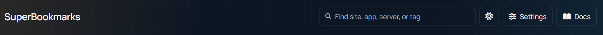
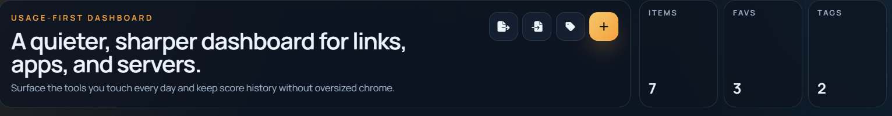
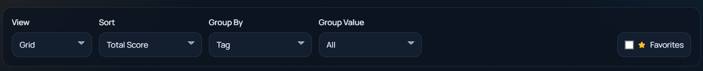
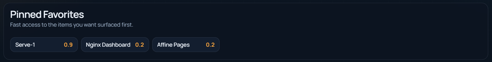
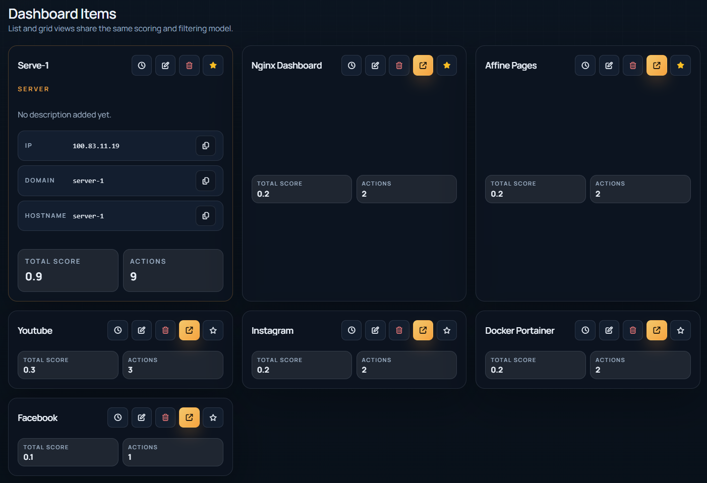
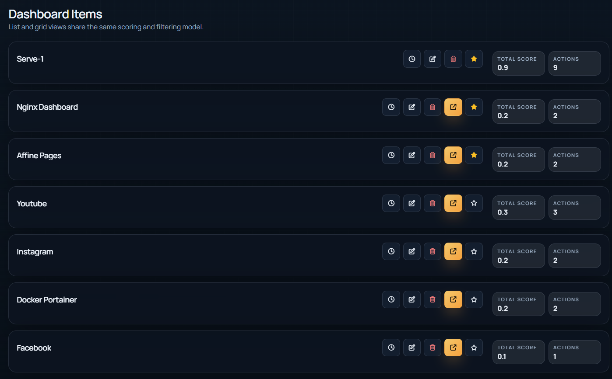
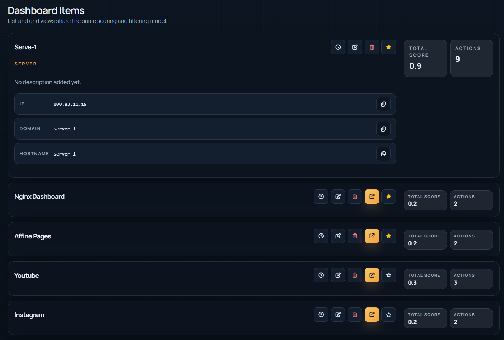
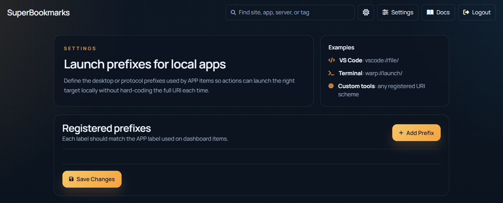

# SuperBookmarks

SuperBookmarks is a NestJS + MongoDB application for collecting frequently used sites, apps, servers, and internal resources in one searchable dashboard. Each trigger appends a score entry, and the dashboard sorts items by favorites and usage so the most relevant resources stay visible.

If this project is useful to you, please add a star on GitHub to support the project and make it easier for others to discover it.

## Current Stack

- NestJS for the backend and routing
- Handlebars for route-level page rendering
- Vue 3, Tailwind CSS, Bootstrap 5, SweetAlert2, and jQuery loaded from CDN for dashboard interactions
- MongoDB with Mongoose for persistence
- Swagger for API documentation
- Basic auth for all application routes
- Docker and Docker Compose for local and production-style environments

## Implemented Foundation

- Global Basic auth for dashboard pages and APIs
- Mongoose schemas for items, tags, scores, and settings
- Item CRUD endpoints
- Tag CRUD endpoints
- Score listing and score append endpoints
- Unified search endpoint with sorting, favorites, and group-by filters
- Dashboard page with list/grid switching, search, score history, and pinned favorites
- Dashboard item creation, editing, deletion, and tag creation with SweetAlert2 dialog workflows
- Settings page for application prefixes used by APP items
- Swagger docs at `/docs`

## Screenshots

### Header And Navigation



### Compact Stats And Quick Actions



### Filters And Grouping Controls



### Pinned Favorites



### Dashboard Items In Grid View



### Dashboard Items In List View

Collapsed preview:



Expanded preview:



### Settings Page



## Project Structure

```text
.
├── public
│   ├── css
│   └── js
├── src
│   ├── auth
│   ├── config
│   ├── database
│   ├── dashboard
│   ├── DTOs
│   ├── entities
│   ├── item
│   ├── search
│   ├── settings
│   └── tag
├── views
│   ├── pages
│   └── parts
├── docker-compose.dev.yml
├── docker-compose.prod.yml
├── Dockerfile
└── tasks.md
```

## Environment Variables

The project ships with both `.env.example` and a local `.env` for development. The current variables are:

- `PORT`: NestJS HTTP port
- `MONGO_URI`: MongoDB connection string
- `BASIC_AUTH_USERNAME`: Basic auth username
- `BASIC_AUTH_PASSWORD`: Basic auth password
- `BASIC_AUTH_REALM`: Browser challenge label
- `DEFAULT_THEME`: Initial UI theme
- `SWAGGER_PATH`: Swagger route path
- `DEFAULT_APP_PREFIXES`: JSON array of default APP prefixes

## Local Development

Install dependencies:

```bash
pnpm install
```

Start Mongo locally or use Docker, then run the app:

```bash
pnpm start:dev
```

Open:

- Dashboard: `http://localhost:3000/`
- Settings: `http://localhost:3000/settings`
- Swagger: `http://localhost:3000/docs`

All routes require the configured Basic auth credentials.

## Docker

Development environment:

```bash
docker compose -f docker-compose.dev.yml up --build
```

Production-style environment:

```bash
docker compose -f docker-compose.prod.yml up --build -d
```

## API Overview

### Items

- `GET /item`
- `POST /item`
- `GET /item/:itemId`
- `PATCH /item/:itemId`
- `DELETE /item/:itemId`
- `GET /item/:itemId/scores`
- `POST /item/:itemId/score`

### Tags

- `GET /tag`
- `POST /tag`
- `GET /tag/:tagId`
- `PATCH /tag/:tagId`
- `DELETE /tag/:tagId`

### Search

- `GET /search?q=...&t=...&sortBy=...&groupBy=...&groupValue=...`

### Settings

- `GET /settings`
- `GET /settings/app-prefixes`
- `PUT /settings/app-prefixes`

## Data Model Summary

### Item

- `title`
- `description`
- `tags[]`
- `type`
- `scores[]`
- `isFav`
- `metaData`

### Tag

- `content`
- `category`

### Score

- `type`
- `triggeredDate`
- `score`

### Setting

- `key`
- `value`

## Notes

- Grouping is currently implemented as a dashboard/search view concern rather than a dedicated collection.
- Time tracking is intentionally out of scope for this version.
- APP item triggers currently rely on saved launch prefixes and item metadata. This part still needs deeper platform-specific handling.

## Next Implementation Targets

- Seed data for local development
- Stronger trigger semantics for APP and SERVER items
- Automated tests for API and scoring behavior
- Browser-level verification for the new dashboard CRUD dialogs

## Author And Support

- Ahmad Kouider
- Website: `koudier.de`
- Support and info: `ahmad@koudier.de`

## License

This project is released under the `MIT` license.

That means users can clone, use, modify, and distribute the project, including for commercial use, as long as the license and copyright notice remain included.

See `LICENSE` for the full text.

## Development Note

This project was developed by Ahmad Kouider with AI Copilot assistance during implementation, iteration, and refinement.
